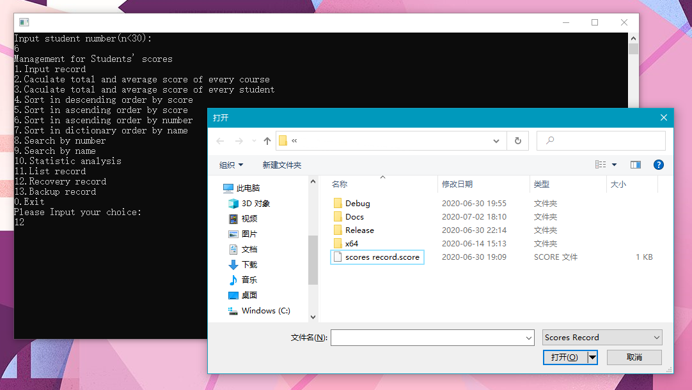

## :clapper: 功能演示


### 开始之前

本次演示使用的样例数据如下：
> 11003001	lisi	87	82	89  
> 11003005	heli	98	92	90  
> 11003003	ludi	75	78	80  
> 11003002	dumo	48	50	67  
> 11003004	zuma	65	69	72  
> 11003006	suyu	100	95	94  


### 程序启动后

程序开始时，需要输入学生的总人数（需要导入多少个学生的成绩就输入多少，不论是手动输入成绩数据还是导入成绩数据文件）
```
Input student number(n<30):
6↙
```
之后，就会显示程序的主界面菜单
```
Management for Students' scores
1.Input record
2.Caculate total and average score of every course
3.Caculate total and average score of every student
4.Sort in descending order by score
5.Sort in ascending order by score
6.Sort in ascending order by number
7.Sort in dictionary order by name
8.Search by number
9.Search by name
10.Statistic analysis
11.List record
12.Recovery record
13.Backup record
0.Exit
Please Input your choice:
```
各选项的功能分别是：
> （1）录入每个学生的学号、姓名和各科考试成绩  
> （2）计算每门课程的总分和平均分  
> （3）计算每个学生的总分和平均分  
> （4）按每个学生的总分由高到低排出名次表  
> （5）按每个学生的总分由低到高排出名次表  
> （6）按学号由小到大排出成绩表  
> （7）按姓名的字典顺序排出成绩表  
> （8）按学号查询学生排名及其考试成绩  
> （9）按姓名查询学生排名及其考试成绩  
> （10）对每门课程分别统计每个类别的人数以及所占的百分比  
> （11）输出每个学生的学号、姓名、各科考试成绩，以及每门课程的总分和平均分  
> （12）恢复学生成绩数据  
> （13）备份学生成绩数据  
> （0）退出程序  

要执行哪一项功能，只需要输入对应的菜单编号即可。
```
Please Input your choice:
12↙ #这里选择执行菜单12
```
:warning: 在学生成绩数据录入之前（执行菜单1或菜单12），请不要执行其他菜单选项。  
:rainbow: 每执行完对应的菜单选项后，程序都会自动回到主界面菜单。  


### 各菜单演示

##### 菜单1 - 录入每个学生的学号、姓名和各科考试成绩
```
Input course number(m<=6):
3↙ #输入课程数量
Input student's ID, name and score: //依次输入学生的学号、姓名、各科目成绩
11003001↙
lisi↙
87↙
82↙
89↙ #完成学生1的成绩录入
11003005↙
heli↙
98↙
92↙
90↙ #完成学生2的成绩录入
......
```

##### 菜单2 - 计算每门课程的总分和平均分
```
course1: sum=473, aver=78.83
course2: sum=466, aver=77.67
course3: sum=492, aver=82.00
```

##### 菜单3 - 计算每个学生的总分和平均分
```
lisi: sum=258, aver=86.00
heli: sum=280, aver=93.33
ludi: sum=233, aver=77.67
dumo: sum=165, aver=55.00
zuma: sum=206, aver=68.67
suyu: sum=289, aver=96.33
```

##### 菜单4 - 按每个学生的总分由高到低排出名次表
```
Sort in ascending order by score :
ID              Name    Course1 Course2 Course3 Sum     Average Rank
11003006        suyu    100     95      94      289     96.33   1
11003005        heli    98      92      90      280     93.33   2
11003001        lisi    87      82      89      258     86.00   3
11003003        ludi    75      78      80      233     77.67   4
11003004        zuma    65      69      72      206     68.67   5
11003002        dumo    48      50      67      165     55.00   6
```

##### 菜单5 - 按每个学生的总分由低到高排出名次表
```
Sort in ascending order by score :
ID              Name    Course1 Course2 Course3 Sum     Average Rank
11003002        dumo    48      50      67      165     55.00   6
11003004        zuma    65      69      72      206     68.67   5
11003003        ludi    75      78      80      233     77.67   4
11003001        lisi    87      82      89      258     86.00   3
11003005        heli    98      92      90      280     93.33   2
11003006        suyu    100     95      94      289     96.33   1
```

##### 菜单6 - 按学号由小到大排出成绩表
```
Sort in ascending order by number :
ID              Name    Course1 Course2 Course3 Sum     Average Rank
11003001        lisi    87      82      89      258     86.00   3
11003002        dumo    48      50      67      165     55.00   6
11003003        ludi    75      78      80      233     77.67   4
11003004        zuma    65      69      72      206     68.67   5
11003005        heli    98      92      90      280     93.33   2
11003006        suyu    100     95      94      289     96.33   1
```

##### 菜单7 - 按姓名的字典顺序排出成绩表
```
Sort in dictionary order by name:
ID              Name    Course1 Course2 Course3 Sum     Average Rank
11003002        dumo    48      50      67      165     55.00   6
11003005        heli    98      92      90      280     93.33   2
11003001        lisi    87      82      89      258     86.00   3
11003003        ludi    75      78      80      233     77.67   4
11003006        suyu    100     95      94      289     96.33   1
11003004        zuma    65      69      72      206     68.67   5
```

##### 菜单8 - 按学号查询学生排名及其考试成绩
```
Input the number you want to search:
11003004↙
ID              Name    Course1 Course2 Course3 Sum     Average Rank
11003004        zuma    65      69      72      206     68.67   5
```

##### 菜单9 - 按姓名查询学生排名及其考试成绩
```
Input the name you want to search:
lisi↙
ID              Name    Course1 Course2 Course3 Sum     Average Rank
11003001        lisi    87      82      89      258     86.00   3
```

##### 菜单10 - 对每门课程分别统计每个类别的人数以及所占的百分比
```
For course 1
<60     1       16.67%
60-69   1       16.67%
70-79   1       16.67%
80-89   1       16.67%
90-99   1       16.67%
100     1       16.67%
For course 2
<60     1       16.67%
60-69   1       16.67%
70-79   1       16.67%
80-89   1       16.67%
90-99   2       33.33%
100     0       0.00%
For course 3
<60     0       0.00%
60-69   1       16.67%
70-79   1       16.67%
80-89   2       33.33%
90-99   2       33.33%
100     0       0.00%
```

##### 菜单11 - 输出每个学生的学号、姓名、各科考试成绩，以及每门课程的总分和平均分
```
ID              Name    Course1 Course2 Course3 Sum     Average Rank
11003001        lisi    87      82      89      258     86.00   3
11003005        heli    98      92      90      280     93.33   2
11003003        ludi    75      78      80      233     77.67   4
11003002        dumo    48      50      67      165     55.00   6
11003004        zuma    65      69      72      206     68.67   5
11003006        suyu    100     95      94      289     96.33   1
```

##### 菜单12 - 恢复学生成绩数据
执行该选项后，程序会弹出一个:file_folder:文件选择窗口，这时请选择后缀为 `.score` 的文件  
> :speech_balloon: `.score`是我们特别设定的一种数据文件格式，类似 `.dat` 。 `.score` 文件包含了除学生人数外的所有成绩数据的原始信息。由于我们并没有对数据文件进行加密，你可以直接使用:clipboard:记事本软件打开并编辑它。  
> :eyes: 我们希望有人来帮助我们写一个对数据文件加密的模块，以满足不同场景的需求。  
<p align="center">
    
</p>

一旦成绩数据文件成功导入，则会在控制台显示以下信息：
```
Successfully choose the path. #成功选择文件路径
<成绩数据文件的具体路径>
Recovery successfully. 成功导入数据文件
```

##### 菜单13 - 备份学生成绩数据
执行该选项后，程序将会在同一目录下:floppy_disk:生成一个名为 `scores record.score` 的文件，并在控制台显示以下信息：
```
Backup successfully. #成功导出数据文件
```

##### 菜单0 - 退出程序
执行该选项会直接退出程序并关闭控制台界面。


### 其它事项

在执行查询功能时，如果查询不到对应学生的成绩信息，则会显示：
```
Not found!
```
如果你在选择执行某一项功能菜单时，输入了主程序菜单以外的选项编号，则会显示：
```
Input error!
```
