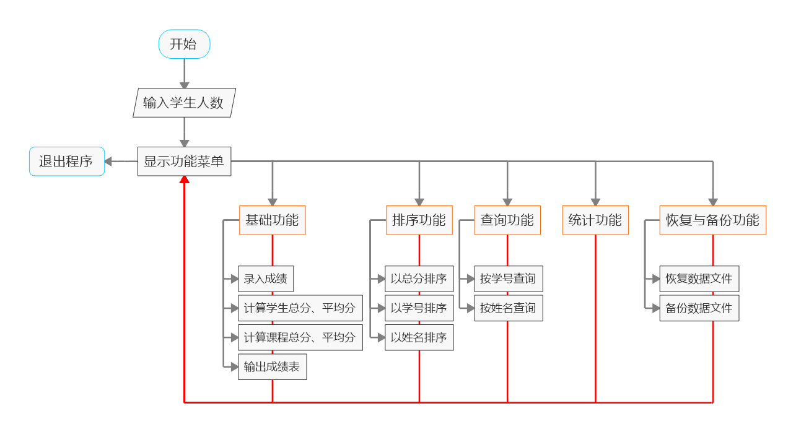
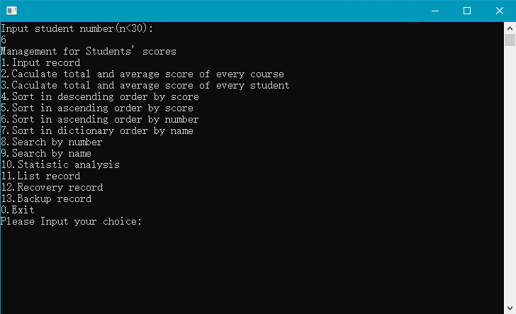

    <svg class="app-logo" viewBox="0 0 128 128" version="1.1" width="150" height="150">
        <path class="cls-2" fill="#e6e6e6" d="M4,116.11A7.89,7.89,0,0,0,11.89,124H116.11a7.89,7.89,0,0,0,7.89-7.89V28.55H4Z"/>
        <path class="cls-3" fill="#525c6b" d="M116.11,4H11.89A7.89,7.89,0,0,0,4,11.89V28.55H124V11.89A7.89,7.89,0,0,0,116.11,4Z"/>    
        <path class="cls-2" fill="#e6e6e6" d="M110.46,19.81a2.81,2.81,0,0,1-2-4.79,2.88,2.88,0,0,1,4,0,2.81,2.81,0,0,1,.82,2,2.8,2.8,0,0,1-2.81,2.8Z"/>
        <path class="cls-2" fill="#e6e6e6" d="M95.87,17a2.81,2.81,0,0,1,2.81-2.82h0A2.82,2.82,0,0,1,101.5,17h0a2.81,2.81,0,0,1-2.82,2.8h0A2.8,2.8,0,0,1,95.87,17Z"/>
        <path class="cls-2" fill="#e6e6e6" d="M86.91,19.81a2.8,2.8,0,0,1-2-.82,2.84,2.84,0,0,1,0-4,2.93,2.93,0,0,1,4,0,2.81,2.81,0,0,1,.82,2,2.8,2.8,0,0,1-2.81,2.8Z"/>
        <path class="cls-5" fill="#30423f" d="M58.85,37.65l-.4.39L41.75,54.75h0l-4.61,4.62V78.85a23.13,23.13,0,0,1,4.61-3.51V61.5H61V42.26H90.65V107.4H77.6a23.55,23.55,0,0,1-3.52,4.48L74,112H95.26V37.65Zm0,21.74H43.63L58.87,44.15Z"/>
        <path class="cls-6" fill="#3fa9f5" d="M56.81,70.25V91L71.49,76.33A20.73,20.73,0,0,0,56.81,70.25Zm-3.32,4.6a20.75,20.75,0,1,0,14.67,35.42L53.49,95.6ZM72.2,80.66,57.53,95.33h0L72.2,110a20.74,20.74,0,0,0,0-29.34Z"/>
    </svg>

<h1 align="center">Student Scores Management System</h1>

一个多功能学生成绩管理系统

    
    
    
    

    
    
    
    

## :book: 概述

一个用C++编写的学生成绩管理系统，通过 `struct` 结构体来储存成绩数据，可以实现对学生成绩的录入、查看、排序、查询、统计、恢复与备份等操作。

#### 基础功能
1.录入学生成绩 --> 菜单1
2.计算每门课程的总分和平均分 --> 菜单2
3.计算每个学生的总分和平均分 --> 菜单3
4.在控制台输出整个成绩表 --> 菜单11

#### 排序功能
5.以总分排序（由高到低/由低到高） --> 菜单4、5
6.以学号排序（由小到大） --> 菜单6
7.以姓名排序（按字典拼音顺序） --> 菜单7
#### 查询功能
8.通过学号查询 --> 菜单8
9.通过姓名查询 --> 菜单9
#### 统计功能
10.对每门课程分别统计[优秀/良好/中等/及格/不及格]的人数以及所占的百分比 --> 菜单10
#### 恢复与备份功能
11.恢复学生成绩数据 --> 菜单12
12.备份学生成绩数据 --> 菜单13

    
    
（程序运行流程）

## :sparkles: 特性

1.恢复成绩数据文件时，可以使用弹出的窗口来选择文件
2.支持将成绩数据导出为csv,xls等表格文件（即将上线）

## :bookmark: 版本

请到[Release](https://github.com/hibioru/Student-Scores-Management-System/releases)页面查看最新的发布版本

    <h4>
        <svg class="octicon octicon-tag" viewBox="0 0 16 16" version="1.1" width="16" height="16" aria-hidden="true"><path fill-rule="evenodd" d="M2.5 7.775V2.75a.25.25 0 01.25-.25h5.025a.25.25 0 01.177.073l6.25 6.25a.25.25 0 010 .354l-5.025 5.025a.25.25 0 01-.354 0l-6.25-6.25a.25.25 0 01-.073-.177zm-1.5 0V2.75C1 1.784 1.784 1 2.75 1h5.025c.464 0 .91.184 1.238.513l6.25 6.25a1.75 1.75 0 010 2.474l-5.026 5.026a1.75 1.75 0 01-2.474 0l-6.25-6.25A1.75 1.75 0 011 7.775zM6 5a1 1 0 100 2 1 1 0 000-2z"></path></svg>
        <a herf="https://github.com/hibioru/Student-Scores-Management-System/releases/tag/2.0.0">2.0.0</a>
    </h4>

> 1.完成了题目的所有要求（V5标准）
> 2.完成了附加题要求
> 3.恢复成绩数据文件时，可以使用弹出的窗口来选择文件

## :clapper: 演示

请到Docs页面查看详细的功能演示实例

    
    
（演示实例 - 主菜单界面）

## :gear: 开发环境

C++标准：C++11
IDE：Visual Studio 2019（Visual Studio 2017、Visual Studio 2013）
Windows SDK 版本：10.0.17763.0
平台工具集：Visual Studio 2019 (v142)

## :memo: 题目要求

> 某班有最多不超过30人（具体人数由键盘输入）参加期末考试，最多不超过6门课程（具体门数由键盘输入）。定义结构体类型，用结构体数组作函数参数，编程实现如下菜单驱动的学生成绩管理系统。
> 
> V5版本要求：
>（1）录入每个学生的学号、姓名和各科考试成绩；
>（2）计算每门课程的总分和平均分；
>（3）计算每个学生的总分和平均分；
>（4）按每个学生的总分由高到低排出名次表；
>（5）按每个学生的总分由低到高排出名次表；
>（6）按学号由小到大排出成绩表；
>（7）按姓名的字典顺序排出成绩表；
>（8）按学号查询学生排名及其考试成绩；
>（9）按姓名查询学生排名及其考试成绩；
>（10）按优秀（90~100）、良好（80~89）、中等（70~79）、及格（60~69）、不及格（0~59）5个类别，对每门课程分别统计每个类别的人数以及所占的百分比；
>（11）输出每个学生的学号、姓名、各科考试成绩，以及每门课程的总分和平均分。
>
>附加要求：
>对于本程序，每次运行程序时，学生的学号、姓名、成绩等信息都需要重新输入，因为这些数据都是存储在掉电即失的内存中的，程序一旦运行结束，这些信息也就丢失了。这对于一个实际系统而言，显然是不实用的。只有在输入这些信息之后，将其以文件的形式保存在永久性磁盘中，每次运行程序都可以从这些磁盘文件中读出相应的数据信息，那么这个系统才是算是实用的。
>在上述程序中增加“备份学生成绩数据文件”和“恢复学生成绩数据文件”两个功能。备份数据就是将数据写入一个文件长期保存，恢复数据就是将数据从保存的数据文件中读出。

## :family: Author / Contributors

    
    <a herf="https://github.com/seeleclover">Seele.Clover&nbsp&nbsp&nbsp&nbsp&nbsp&nbsp</a>
    
    <a herf="https://github.com/LEEkabe">LEEkabe&nbsp&nbsp&nbsp&nbsp&nbsp&nbsp</a>
    
    <a herf="https://github.com/131wcc">131wcc&nbsp&nbsp&nbsp&nbsp&nbsp&nbsp</a>

### 请给我们一个Star吧！
<iframe src="https://ghbtns.com/github-btn.html?user=hibioru&repo=Student-Scores-Management-System&type=star&count=true&size=large" frameborder="0" scrolling="0" width="160" height="30" title="GitHub" align="middle"></iframe>
